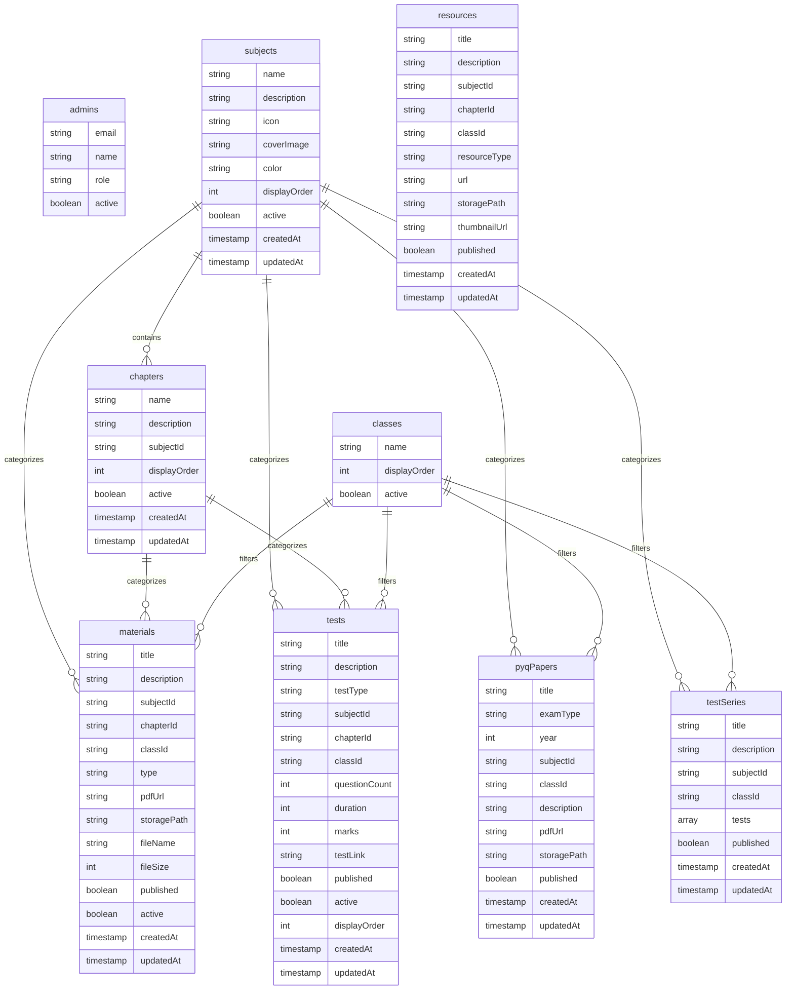

# Firebase Firestore Database Schema - DSC Guidance

This schema details the collections, data types, relationships, and document structures shared between the React Admin Panel and the Android Student Application.

---

## Shared Collections



---

## Schema Reference

### 1. `admins`
Admin and tutor registration mapping for role-based authorization check.
- **Collection Path:** `/admins/{uid}`
- **Fields:**
  - `email` (string): User email address.
  - `name` (string): Display name.
  - `role` (string): `"admin"` (full control) or `"tutor"` (educational content creator).
  - `active` (boolean): Authorization lock (must be `true` to gain access).

### 2. `subjects`
Main subject catalog shown on the Student App homepage.
- **Collection Path:** `/subjects/{subjectId}`
- **Fields:**
  - `name` (string): E.g., `"Biology"`, `"Psychology"`.
  - `description` (string): Summary.
  - `icon` (string): Lucide icon identifier.
  - `coverImage` (string, optional): Cover photo URL.
  - `color` (string): Color hex representation (e.g. `"#16A34A"`).
  - `displayOrder` (number): Order sequence for layout placement.
  - `active` (boolean): Visibility switch.
  - `createdAt` (timestamp)
  - `updatedAt` (timestamp)

### 3. `chapters`
Topic breakdowns tied to subjects.
- **Collection Path:** `/chapters/{chapterId}`
- **Fields:**
  - `name` (string): E.g., `"Cell Biology"`.
  - `description` (string): Chapter content preview.
  - `subjectId` (string): Foreign key reference to `subjects` document ID.
  - `displayOrder` (number): Chapter order within the subject.
  - `active` (boolean): Visibility switch.
  - `createdAt` (timestamp)
  - `updatedAt` (timestamp)

### 4. `classes`
Grade divisions for filtered study.
- **Collection Path:** `/classes/{classId}`
- **Fields:**
  - `name` (string): E.g., `"Class 6"`.
  - `displayOrder` (number): Sorting index.
  - `active` (boolean): Status.

### 5. `materials`
Pointers to uploaded study PDFs and Notes.
- **Collection Path:** `/materials/{materialId}`
- **Fields:**
  - `title` (string): Note name.
  - `description` (string)
  - `subjectId` (string): Reference ID.
  - `chapterId` (string, optional): Reference ID.
  - `classId` (string, optional): Reference ID.
  - `type` (string): `"NOTES"`, `"PDF"`, `"STUDY_MATERIAL"`, `"REFERENCE"`.
  - `pdfUrl` (string): Download/read URL from Firebase Storage.
  - `storagePath` (string): Storage file reference for deletions (e.g. `"materials/1739281.pdf"`).
  - `fileName` (string): Local name.
  - `fileSize` (number): Size in bytes.
  - `published` (boolean): Admin draft status.
  - `active` (boolean): Active state.
  - `createdAt` (timestamp)
  - `updatedAt` (timestamp)

### 6. `pyqPapers`
Past examination documents.
- **Collection Path:** `/pyqPapers/{paperId}`
- **Fields:**
  - `title` (string)
  - `examType` (string): `"DSC"`, `"TET"`, `"OTHER"`.
  - `year` (number): Examination year.
  - `subjectId` (string): Reference ID.
  - `classId` (string, optional): Reference ID.
  - `description` (string)
  - `pdfUrl` (string): Storage path URL.
  - `storagePath` (string)
  - `published` (boolean)
  - `createdAt` (timestamp)
  - `updatedAt` (timestamp)

### 7. `tests`
Exams with external URLs.
- **Collection Path:** `/tests/{testId}`
- **Fields:**
  - `title` (string)
  - `description` (string)
  - `testType` (string): `"DAILY"`, `"CHAPTER_WISE"`, `"CLASS_WISE"`, `"PREVIOUS_YEAR"`, `"PRACTICE"`.
  - `subjectId` (string): Reference ID.
  - `chapterId` (string, optional)
  - `classId` (string, optional)
  - `questionCount` (number)
  - `duration` (number): Time limit in minutes.
  - `marks` (number)
  - `testLink` (string): External quiz URL (e.g. Google Forms).
  - `published` (boolean)
  - `active` (boolean)
  - `displayOrder` (number)
  - `createdAt` (timestamp)
  - `updatedAt` (timestamp)

### 8. `testSeries`
Group of multiple tests for subscription.
- **Collection Path:** `/testSeries/{seriesId}`
- **Fields:**
  - `title` (string)
  - `description` (string)
  - `subjectId` (string)
  - `classId` (string, optional)
  - `tests` (array of strings): Array of `testId` strings in order.
  - `published` (boolean)
  - `createdAt` (timestamp)
  - `updatedAt` (timestamp)

### 9. `resources`
Expanded repository pointers.
- **Collection Path:** `/resources/{resourceId}`
- **Fields:**
  - `title` (string)
  - `description` (string)
  - `subjectId` (string)
  - `chapterId` (string, optional)
  - `classId` (string, optional)
  - `resourceType` (string): `"PDF"`, `"VIDEO"`, `"LINK"`, `"NOTES"`, `"DOCUMENT"`, `"OTHER"`.
  - `url` (string): Target reference URL or upload URL.
  - `storagePath` (string, optional)
  - `thumbnailUrl` (string, optional)
  - `published` (boolean)
  - `createdAt` (timestamp)
  - `updatedAt` (timestamp)

---

## Guidelines for Android App Consumption

For real-time sync in the student Android app:
1. **Firestore Query Listeners:** Android must bind listeners to active/published documents only.
   - Example query (Java/Kotlin):
     ```kotlin
     FirebaseFirestore.getInstance()
         .collection("subjects")
         .whereEqualTo("active", true)
         .orderBy("displayOrder", Query.Direction.ASCENDING)
         .addSnapshotListener { snapshot, e -> ... }
     ```
2. **Filtering nested items:** Fetching chapters for a selected subject:
     ```kotlin
     db.collection("chapters")
         .whereEqualTo("subjectId", selectedSubjectId)
         .whereEqualTo("active", true)
         .orderBy("displayOrder", Query.Direction.ASCENDING)
     ```
3. **Downloading PDFs:** Load PDFs directly from `pdfUrl` using standard libraries (e.g., custom Chrome tabs or PDF libraries).
4. **Launching Quizzes:** Tests can be launched by loading `testLink` inside an in-app WebView or triggering a system browser Intent.
